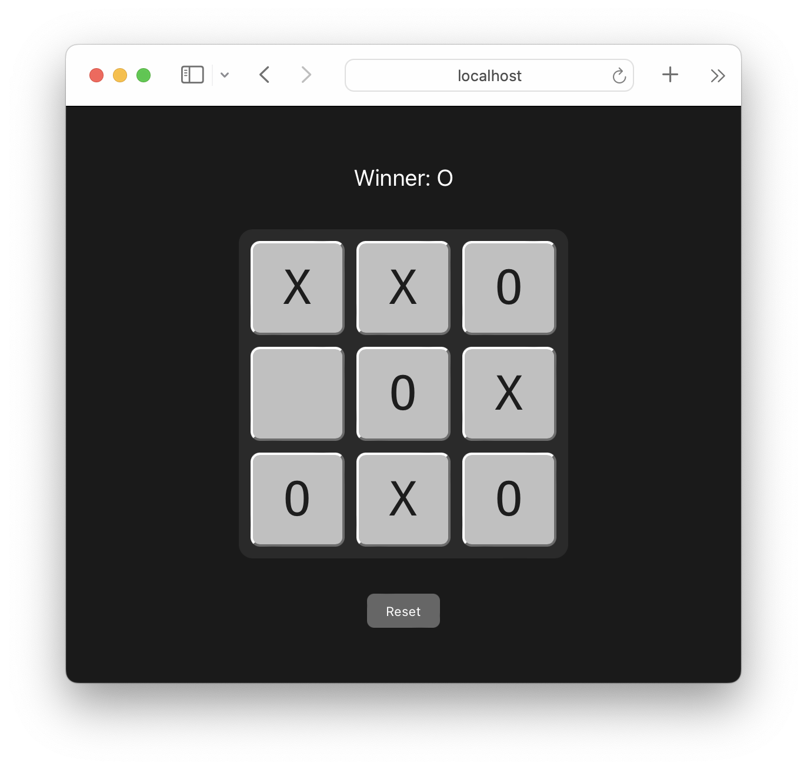

# React Tic-Tac-Toe

Classic Tic-Tac-Toe game using React and Vite.

## Components

### Smart Components

- Game (`src/components/Game/Game.jsx`): Manages the overall state of the game, including the current player, game status, and the game field. It also handles the reset functionality.
- Field (`src/components/Field/Field.jsx`): Manages the state of the game field and handles user interactions with the game squares.
- Information (`src/components/Information/Information.jsx`): Displays the current game status, including the current player, game result, and draw status.

### Dumb Components

- GameLayout (`src/components/Game/GameLayout.jsx`): Renders the layout of the game, including the information and field components, and the reset button.
- FieldLayout (`src/components/Field/FieldLayout.jsx`): Renders the game field as a grid of buttons representing the squares.
- InformationLayout (`src/components/Information/InformationLayout.jsx`): Renders the game status information.

## Development

To start the development server, run:

`npm run dev`

To build the project for production, run:

`npm run build`

To preview the production build, run:

`npm run preview`

To lint the code, run:

`npm run lint`
